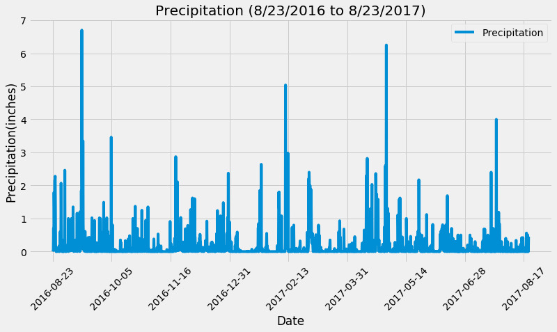
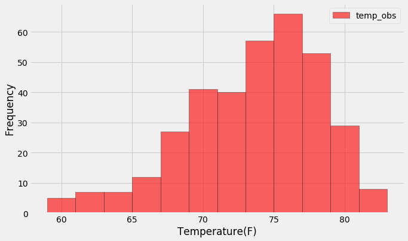
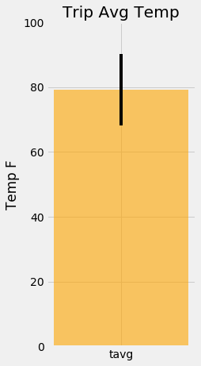
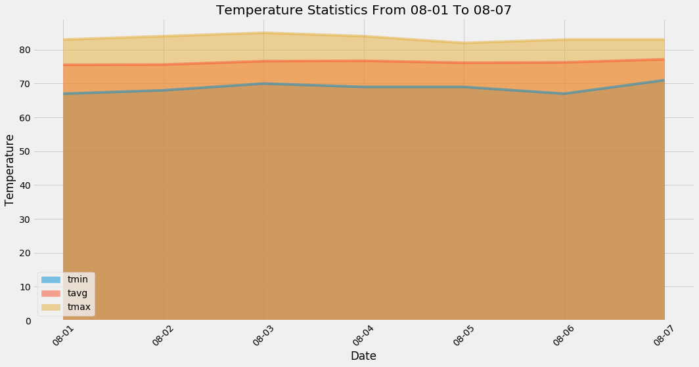

# SQLAlchemy Homework - Surfs Up!

I've decided to treat myself to a long holiday vacation in Honolulu, Hawaii! For the trip planning, I need to do some climate analysis on the area. 

## Step 1 - Climate Analysis and Exploration

### Dependencies used
* SQLAlchemy
* Matplotlib
* Pandas
* Numpy and Scipy

### Files Used
* [starter notebook](climate_starter.ipynb)
* [hawaii.sqlite](Resources/hawaii.sqlite)

### Analysis
* Choose a start date and end date for your trip: '08/01 - 08/07'

* Using SQLAlchemy:
  * Use `create_engine` to connect to your sqlite database.
  * Use `automap_base()` to reflect your tables into classes and save a reference to those classes called `Station` and `Measurement`.

#### Precipitation Analysis

* Plot the precipitation the last 12 months (8/23/2016 to 8/23/2017)

* Print the summary statistics for the precipitation data.

#### Station Analysis

* Find the most active stations: 'USC00519281'

* Retrieve the last 12 months of temperature observation data (TOBS).

  * Filter by the station with the highest number of observations.

  * Plot the results as a histogram with `bins=12`.

    

- - -

## Step 2 - Climate App

### Dependency used
* Flask to create routes.

### Routes

* `/`

  * Home page.

  * List all routes that are available.

* `/api/v1.0/precipitation`

  * Convert the query results to a dictionary using `date` as the key and `prcp` as the value.

  * Return the JSON representation of your dictionary.

* `/api/v1.0/stations`

  * Return a JSON list of stations from the dataset.

* `/api/v1.0/tobs`
  * Query the dates and temperature observations of the most active station for the last year of data.
  
  * Return a JSON list of temperature observations (TOBS) for the previous year.

* `/api/v1.0/<start>` and `/api/v1.0/<start>/<end>`

  * Return a JSON list of the minimum temperature, the average temperature, and the max temperature for a given start or start-end range.

## Bonus: Other Recommended Analyses

### Temperature Analysis I

* Test if June and December temperature observations were significantly different using a t-test.

### Temperature Analysis II

Calculate and plot the min, avg, and max temperature for my chosen trip date (08/01/2017 - 08/07/2017) as a bar chart.
  

### Daily Rainfall Average

* Calculate the daily normals between 08/01/2020 and 08/07/2020. Normals are the averages for the min, avg, and max temperatures.

* Plot an stacked area plot for displaying the daily normals

  

